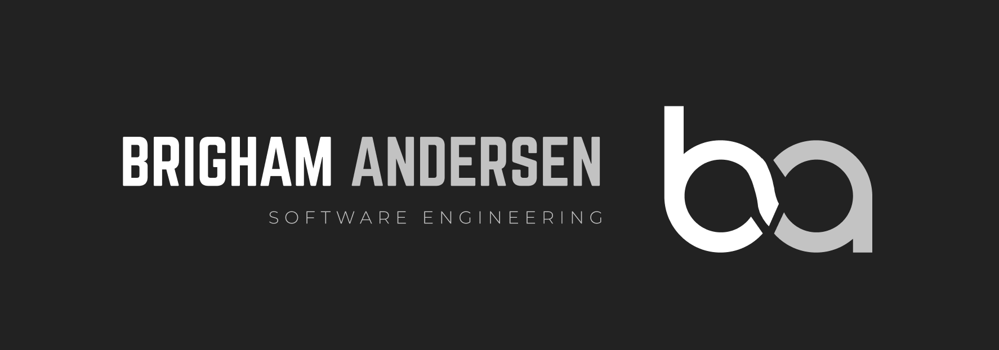

# I’m Brigham Andersen and I build technology that boosts productivity.  💯

 

<!DOCTYPE html>
<html lang="en">
<head>
  
</head>
<body>
  

    
    
  

</body>
</html>

I love solving the problem users hate most – wasting time. We all detest menial tasks, but computers can automate them, freeing us for impactful work.  Obsessed with the time-saving potential of technology, I’ve created my career in software engineering. 

My career vision is to build technology that helps users and businesses boost their productivity. I give my all to this vision so others can give their all to theirs. I’ve assisted numerous startups along with Fortune 500 companies like Nike, Oracle, Chick-fil-A, McDonald's, and Walmart. If you or your business could benefit from saving time and getting more done, I’m happy to assist you!

### Make sure to check out my website [(brighamandersen.com)](https://brighamandersen.com) to learn more about me and the work I do! 😁
